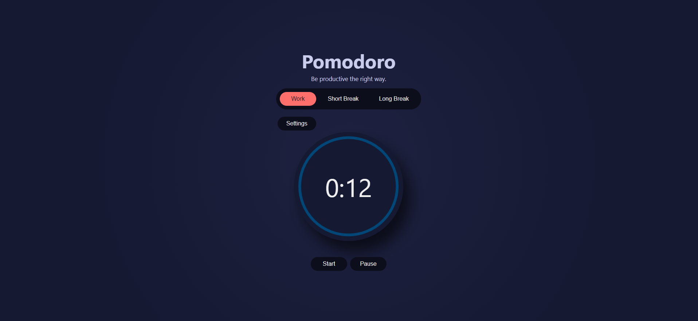
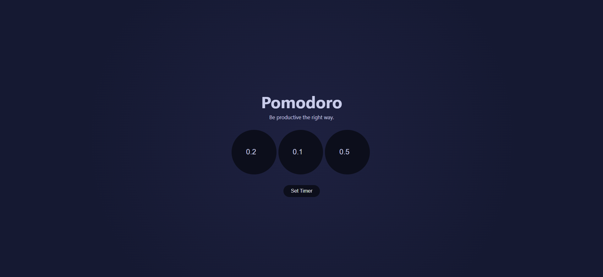

# Pomodoro Application

This project was bootstrapped with [Create React App](https://github.com/facebook/create-react-app).

#### This app is based on Pomodoro Technique which is a time management method based on 25-minute stretches of focused work broken by five-minute breaks. Longer breaks, typically 15 to 30 minutes, are taken after four consecutive work intervals. Each work interval is called a pomodoro, the Italian word for tomato (plural: pomodori). 

## Features
- Adjust the timer for work, short break and long break respectively
- Select the mode among Work, Short Break and Long Break according to your choice and mood 